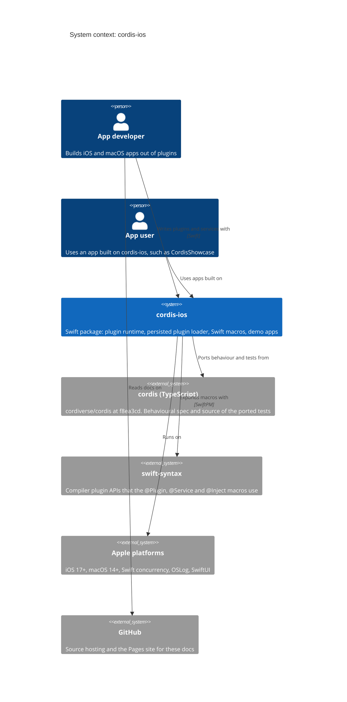
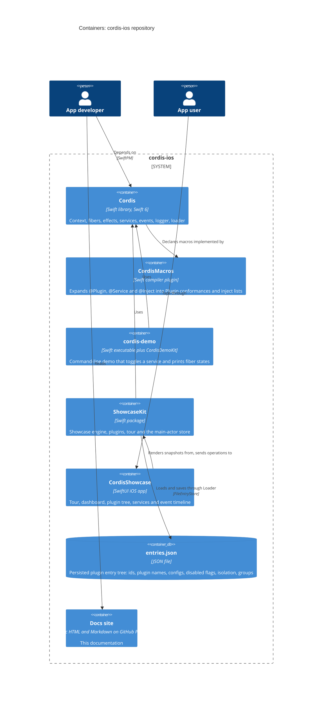
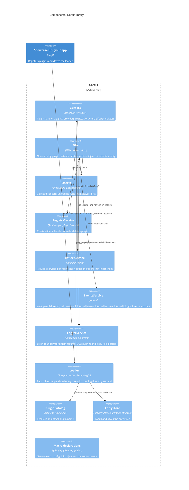
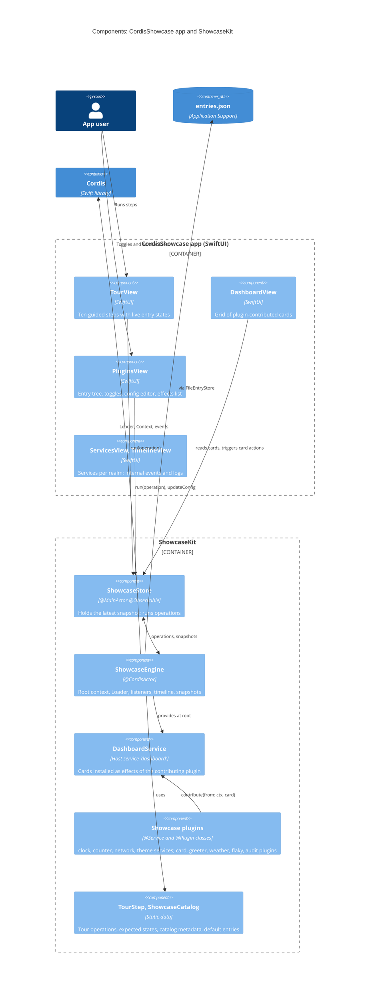
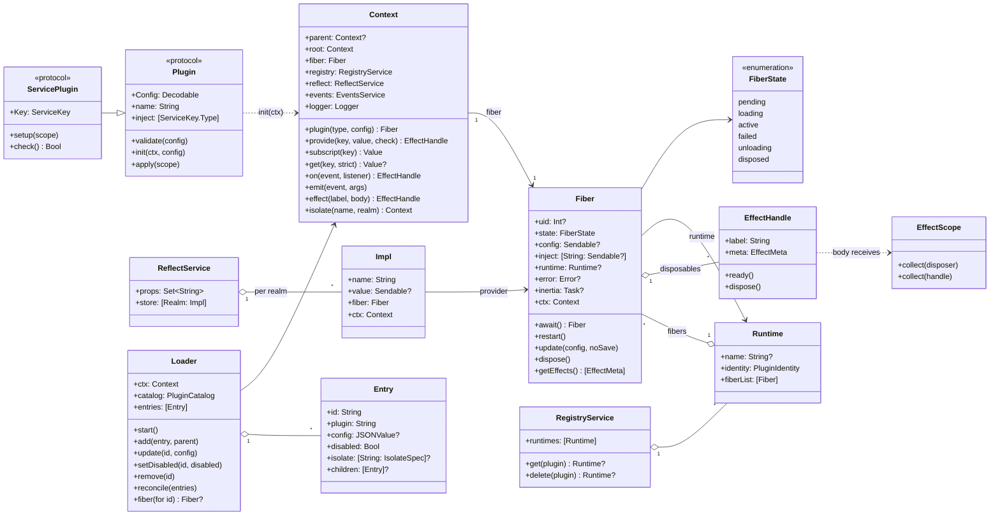
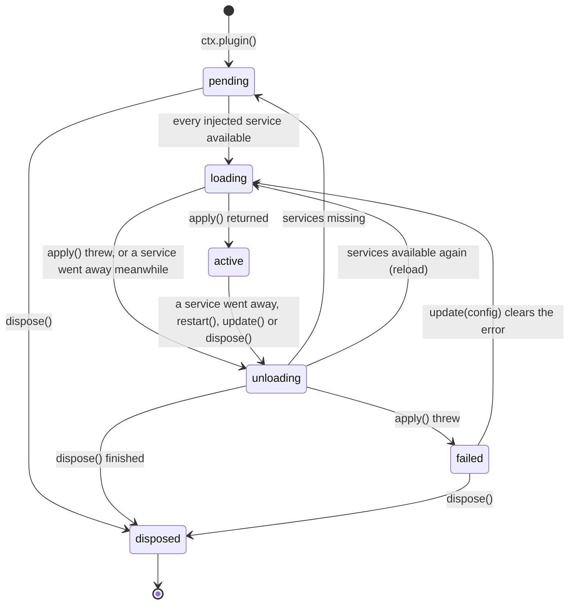
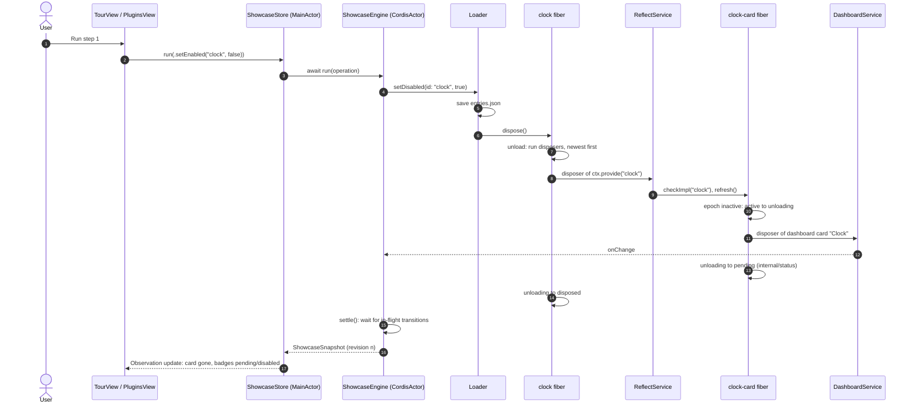
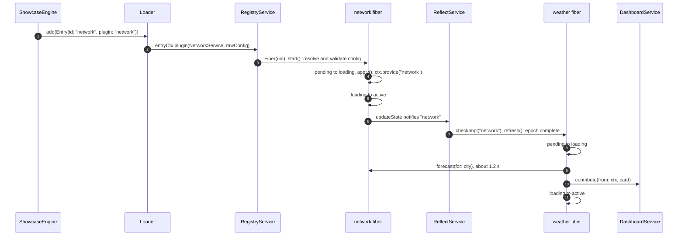
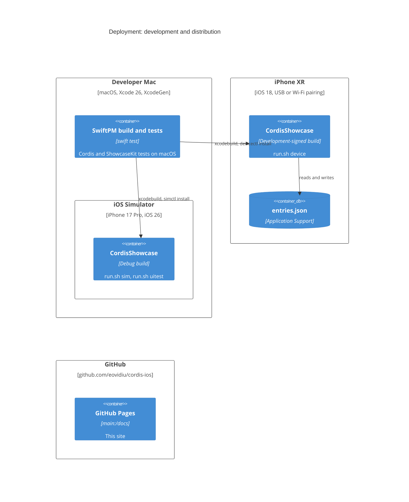

# Architecture (C4 model)

This page describes cordis-ios with the [C4 model](https://c4model.com): system context, containers, components and code. Each level zooms into one box of the level above. Dynamic and deployment views follow the static levels. The diagrams are Mermaid source in [`docs/pages/architecture.md`](https://github.com/eovidiu/cordis-ios/blob/main/docs/pages/architecture.md), so they change with the code in the same commit.

| Level | Diagram | Question it answers |
| --- | --- | --- |
| 1 | [System context](#level-1-system-context) | Who uses cordis-ios, and what does it depend on? |
| 2 | [Containers](#level-2-containers) | Which modules, apps and stores make up the repository? |
| 3 | [Components: Cordis library](#level-3-components-cordis-library) | What are the parts of the plugin runtime? |
| 3 | [Components: CordisShowcase](#level-3-components-cordisshowcase) | How does the demo app sit on top of the runtime? |
| 4 | [Code](#level-4-code) | Which types implement the runtime, and how does a fiber change state? |
| + | [Dynamic views](#dynamic-views) | What happens, step by step, when a service goes away or a plugin loads? |
| + | [Deployment](#deployment) | Where does each part run? |

## Level 1: System context

cordis-ios is a Swift package. App developers write plugins against it, and the runtime loads and unloads those plugins as the services they depend on appear and disappear. The TypeScript [cordis](https://github.com/cordiverse/cordis) project is the behavioural specification: its tests were ported, and every difference from it is listed in the [README](https://github.com/eovidiu/cordis-ios#differences-from-cordis).



## Level 2: Containers

The repository holds one library, one compiler plugin, two demos and their test suites. Both demos persist their plugin tree as an `entries.json` file that the `Loader` reads and writes.



| Container | Path | Tested by |
| --- | --- | --- |
| Cordis | `Sources/Cordis` | `swift test` (`Tests/CordisTests`, ported from cordis) |
| CordisMacros | `Sources/CordisMacros` | `Tests/CordisMacrosTests` (expansion tests) |
| cordis-demo | `Sources/CordisDemo`, `Sources/CordisDemoKit` | `Tests/CordisTests/DemoTests.swift` |
| ShowcaseKit | `Examples/CordisShowcase/ShowcaseKit` | `swift test --package-path Examples/CordisShowcase/ShowcaseKit` |
| CordisShowcase | `Examples/CordisShowcase/App` | `Examples/CordisShowcase/run.sh uitest` (XCUITest) |
| Docs site | `docs/` | `docs/check.sh` |

## Level 3: Components, Cordis library

Every runtime object lives on one global actor, `CordisActor`, which takes the place of JavaScript's single thread. A `Context` is the handle that plugins receive. Each context also exposes the root services shared by its tree: registry, reflect, events and logger.



The rules that tie these components together:

- **Services gate plugins.** A fiber's *epoch* is built from the uids of the fibers that provide each service it injects. A missing service makes the epoch inactive, so the fiber unloads to `pending`. When every service is present, the fiber loads. When a provider is replaced, the epoch changes and the fiber reloads.
- **Effects make unloading total.** Everything a plugin installs is an effect: service provisions, listeners, child plugins, logger exporters, and the showcase's dashboard cards. Unloading runs the collected disposers newest first. No plugin needs its own teardown code.
- **Realms isolate names.** `ctx.isolate("theme")` gives a context its own realm for `theme`. A provider and a consumer see each other only when their contexts resolve the name to the same realm.

## Level 3: Components, CordisShowcase

The showcase keeps cordis on `CordisActor` and SwiftUI on the main actor. Cordis-side state crosses to the UI only as immutable `ShowcaseSnapshot` values.



## Level 4: Code

### Runtime types



### Fiber state machine

A fiber moves between states as its injected services come and go. Every transition is emitted as `internal/status`. The Timeline tab in the showcase shows these events as they happen.



### Macro expansion

`@Plugin` and `@Service` remove the boilerplate that every plugin would otherwise repeat:

```swift
@CordisActor @Plugin
final class ClockCardPlugin {
  @Inject(DashboardKey.self) var dashboard: DashboardService
  @Inject(ClockKey.self) var clock: ClockService
  func apply(_ scope: EffectScope) async throws { … }
}
// @Plugin adds these members:
public let ctx: Context
public let config: NoConfig          // the class's `typealias Config`, if it declares one
public init(ctx: Context, config: NoConfig) { self.ctx = ctx; self.config = config }
public nonisolated static var inject: [any ServiceKey.Type] { [DashboardKey.self, ClockKey.self] }
// and this conformance:
extension ClockCardPlugin: Cordis.Plugin {}
// Each @Inject property becomes a throwing getter:
var dashboard: DashboardService { get throws { try ctx[DashboardKey.self] } }
```

## Dynamic views

### Withdrawing a service

This is tour step 1, *disable clock*. The UI never removes the clock card itself. The card goes away because it is an effect of `clock-card`, and `clock-card` unloads when its injected `clock` service is withdrawn.



### Loading a plugin whose service arrives late

This is tour step 5. `weather` has been `pending` since launch because nothing provides `network`. Adding a network entry starts the load. The plugin's `apply` then waits on a simulated request, so the fiber stays in `loading` long enough to watch.



## Deployment


