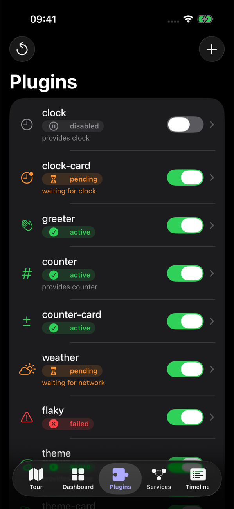
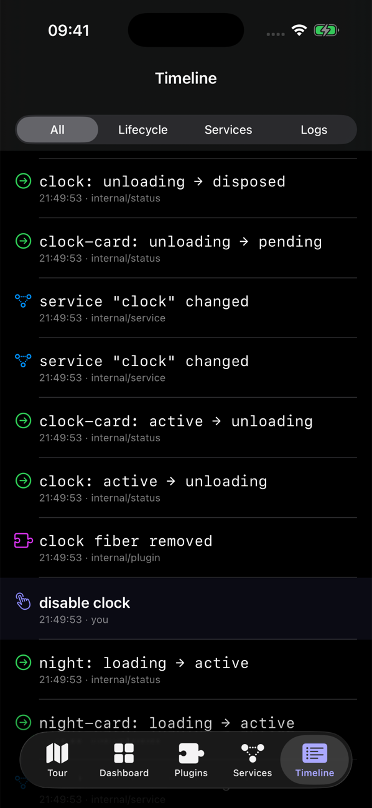
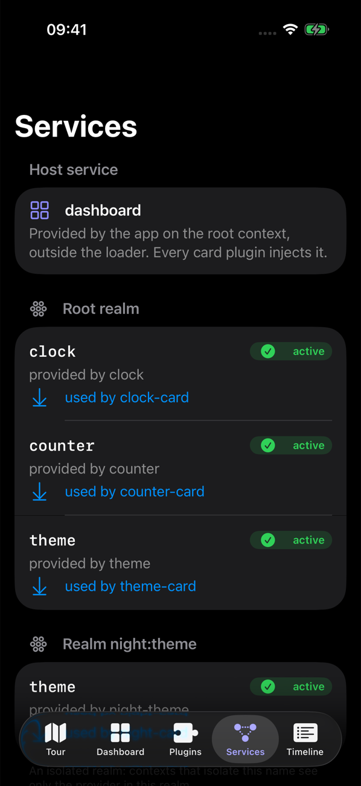
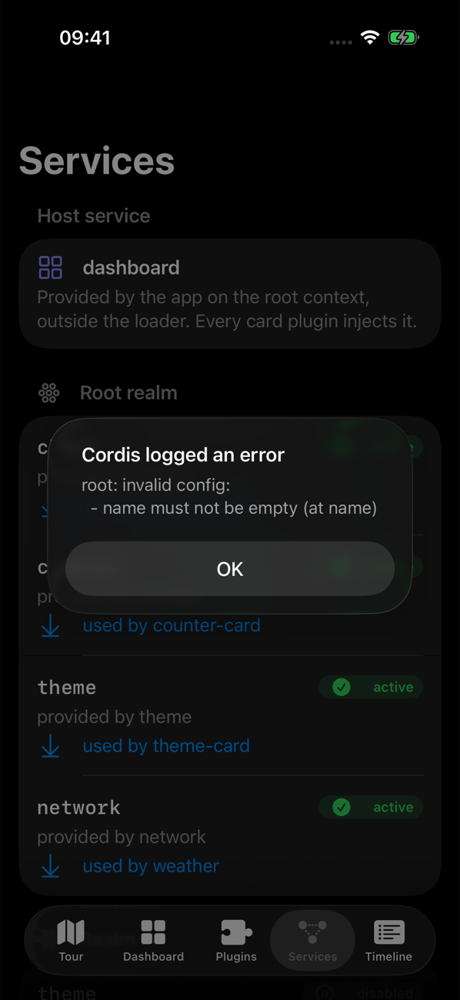

# Concepts

cordis builds an app from plugins and keeps them consistent with each other while they are switched on and off. This page introduces one idea at a time. Each idea links to the part of the [showcase app](showcase.md) where you can watch it happen.

## Context

A `Context` is a plugin's handle on the system. `Context()` creates a root context. Every other context is derived from a parent: each plugin instance gets its own, and `isolate` and `extend` derive new ones. Through its context a plugin:

| Call | Effect |
| --- | --- |
| `ctx.plugin(P.self, config:)` | Starts a child plugin; the child stops when this plugin stops |
| `ctx.provide(Key.self, value)` | Offers a service to every context in the same realm |
| `ctx[Key.self]` | Reads a service the plugin declared in its `inject` list |
| `ctx.on(Event.self) { … }` | Listens to an event until the plugin stops |
| `ctx.effect { scope in … }` | Installs anything else that must be undone later |
| `ctx.logger` | Logs under the plugin's name |

All of this runs on one global actor, `CordisActor`, which plays the role of JavaScript's single thread.

## Plugin and fiber

A **plugin** is a type with an optional config and an `apply(_:)` method. A **fiber** is one running instance of a plugin under a parent context. The same plugin can run as several fibers with different configs: the showcase runs the `theme` plugin twice, once as entry `theme` and once as entry `night-theme`.

A fiber is always in one of six states:

| State | Meaning |
| --- | --- |
| `pending` | Waiting until every injected service is available |
| `loading` | `apply()` is running |
| `active` | Loaded; its effects are live |
| `unloading` | Its effects are being disposed |
| `failed` | `apply()` threw; `update(config)` or `restart()` retries |
| `disposed` | Removed |

The [fiber state machine](architecture.md#fiber-state-machine) shows the transitions. The showcase's **Plugins** tab shows each entry's state as a badge, and the **Timeline** tab lists every `internal/status` transition.



## Effects

Everything a plugin installs is an **effect**, and each effect carries a disposer. When the fiber unloads, cordis runs the disposers newest first. Teardown therefore always matches setup, and a plugin never needs separate teardown code.

```swift
try ctx.effect("dashboard card", sync: {
  cards.append(card)
  return { cards.removeAll { $0.id == card.id } }   // runs on unload
})
```

`fiber.getEffects()` lists the live effects; the showcase prints them in each entry's detail view. In the showcase, a dashboard card is an effect of the plugin that contributed it. When that plugin stops for any reason (disabled, its service withdrawn, its group disabled, the entry removed), the card disappears without any card-removal code in the UI.

## Services and injection

A **service** is a value provided under a name. A service plugin conforms to `ServicePlugin` (generated by `@Service`). It provides itself when it loads, and consumers can use it once the providing fiber is `active`.

A plugin declares what it needs with `@Inject`. The macro adds each key to the plugin's `inject` list. While any injected service is missing, the fiber waits in `pending`. A fiber also records which provider fiber supplied each service. If a provider is replaced, for example by restarting the `counter` service, every consumer reloads against the new instance.

| Showcase entry | Injects | What you see |
| --- | --- | --- |
| `clock-card` | `dashboard`, `clock` | Pending while `clock` is disabled |
| `counter-card` | `dashboard`, `counter` | Reloads (count back to 0) when `counter` restarts |
| `weather` | `dashboard`, `network` | Pending until you add a `network` entry |

## Events

`ctx.emit`, `parallel`, `serial`, `bail` and `waterfall` dispatch typed events (`EventKey`). Listeners are effects, so they are removed when their plugin stops. cordis emits four internal events:

| Event | When |
| --- | --- |
| `internal/plugin` | A fiber was created or removed |
| `internal/status` | A fiber changed state |
| `internal/service` | A service was provided, withdrawn or changed availability |
| `internal/update` | `fiber.update(config)` (a waterfall: a listener can veto) |

The showcase's `clock` service emits `showcase/tick`, and `clock-card` re-renders on each tick. The `audit` plugin counts every `internal/status` transition in the system.



## Realms (isolation)

Each service name resolves in a **realm**. By default every context shares the root realm. `ctx.isolate("theme")` gives a context, and everything under it, a separate realm for `theme`. A provider and a consumer see each other only when they resolve the name to the same realm.

In the showcase, the `night` group isolates `theme`. Inside the group, `night-card` resolves `theme` to `night-theme`. Outside it, `theme-card` resolves `theme` to `theme`. Disabling `night-theme` affects only `night-card`.



## Config and validation

A plugin's `Config` is `Decodable & Sendable`, with an optional static `validate`. The loader stores each entry's config as JSON and decodes it for the plugin. A config that fails decoding or validation never reaches `apply()`:

- When the plugin starts, the fiber fails with a `ValidationError`.
- On `update`, the running instance keeps its previous config and the error is logged.



## Loader

The `Loader` runs a persisted tree of `Entry` values against a `PluginCatalog`:

```json
[
  { "id": "clock", "plugin": "clock", "config": { "interval": 1 } },
  { "id": "clock-card", "plugin": "clock-card" },
  { "id": "night", "plugin": "group", "isolate": { "theme": true }, "children": [
    { "id": "night-theme", "plugin": "theme", "config": { "name": "Night", "tint": "indigo" } },
    { "id": "night-card", "plugin": "theme-card" }
  ] }
]
```

Every mutation (`add`, `remove`, `update`, `setDisabled`, `reconcile`) saves the tree, then reconciles the running fibers with it by entry id:

| Change | Result |
| --- | --- |
| New id | New fiber |
| Removed id | Fiber disposed |
| `disabled` | Fiber disposed; entry kept |
| `config` changed | `fiber.update(config)`: validate, then reload |
| `plugin` or `isolate` changed | Fiber rebuilt |
| `children` | The group's children are reconciled by the same rules |
| Unchanged | Keeps running |
