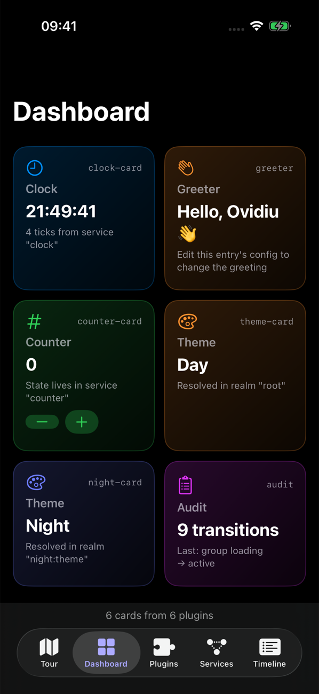

# cordis-ios

**cordis-ios is a native Swift port of the [cordis](https://github.com/cordiverse/cordis) plugin framework for iOS 17+ and macOS 14+.** An app built with it is a tree of plugins that can be switched on and off while the app runs:

- A plugin runs only while every service it declares is available.
- When a plugin stops, everything it did is undone automatically: listeners, provided services, child plugins, UI contributions.
- The plugin tree can be persisted as JSON and reconciled at runtime by the `Loader`.

The port follows cordis commit `f8ea3cd` (`cordis@4.0.0-rc.10`) and the paper [arXiv 2608.25512](https://arxiv.org/abs/2608.25512). The cordis test suite was ported along with the code.



## Where to go next

| Page | What you will find |
| --- | --- |
| [Concepts](concepts.md) | Contexts, fibers, effects, services, events, realms and the loader, one idea at a time |
| [Architecture (C4)](architecture.md) | System context, containers, components, code, dynamic and deployment diagrams |
| [Showcase app](showcase.md) | The iOS demo app: what each tab shows, the guided tour, and how to run it on a simulator or an iPhone |

## Install

```swift
// Package.swift
dependencies: [
  .package(url: "https://github.com/eovidiu/cordis-ios.git", branch: "main"),
],
targets: [
  .target(name: "MyApp", dependencies: [.product(name: "Cordis", package: "cordis-ios")]),
]
```

## A first plugin

```swift
import Cordis
import Foundation

enum ClockKey: ServiceKey {
  typealias Value = ClockService
  static let name = "clock"
}

@CordisActor @Service(ClockKey.self)
final class ClockService {
  func now() -> Date { Date() }
}

@CordisActor @Plugin
final class Greeter {
  @Inject(ClockKey.self) var clock: ClockService   // generates `inject = [ClockKey.self]`

  func apply(_ scope: EffectScope) async throws {
    print("hello at \(try clock.now())")
    try scope.collect { print("bye") }              // runs when the plugin is unloaded
  }
}

@CordisActor func run() async throws {
  let root = Context()
  let greeter = try root.plugin(Greeter.self)       // pending: no clock yet
  let clock = try await root.plugin(ClockService.self).await()
  try await greeter.await()                          // active: prints "hello at …"
  try await clock.dispose()                          // greeter unloads ("bye"), back to pending
}
```

## Running the persisted loader

```swift
var catalog = PluginCatalog()
catalog.register(ClockService.self, as: "clock")
catalog.register(Greeter.self, as: "greeter")
let loader = Loader(ctx: root, catalog: catalog, store: FileEntryStore(url: entriesURL))
try await loader.start()                          // runs entries.json
try await loader.setDisabled(id: "clock", true)  // saves, then unloads clock and greeter
```

## Project status

| Area | State |
| --- | --- |
| Core: effects, fibers, context, registry, reflect, services, isolation | Ported with tests |
| Events service: emit, parallel, serial, bail, waterfall, scopes | Ported with tests |
| Logger service: buffer and exporters | Ported with tests |
| Swift macros `@Plugin`, `@Service`, `@Inject` | Implemented with expansion tests |
| Loader: persisted entries, groups, isolation | Ported (no hot reload) with tests |
| CordisShowcase iOS app | Engine tests and XCUITests |

Every intentional difference from cordis is listed in the [README](https://github.com/eovidiu/cordis-ios#differences-from-cordis).
