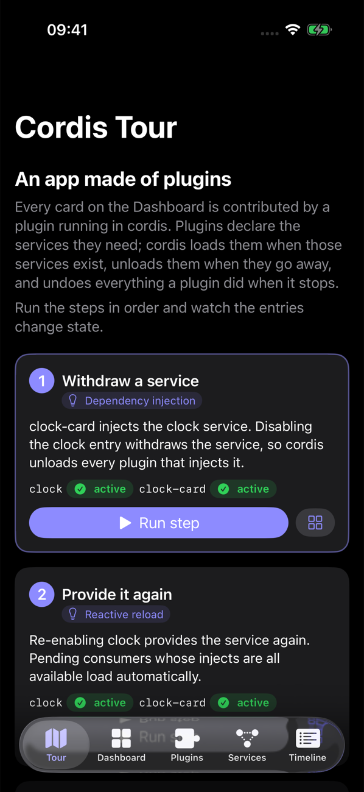

# Showcase app

**CordisShowcase** is a SwiftUI app for iPhone and iPad (iOS 17+). Everything it displays comes from plugins that a cordis `Loader` runs. Its source is in [`Examples/CordisShowcase`](https://github.com/eovidiu/cordis-ios/tree/main/Examples/CordisShowcase).

<div class="gallery">
  <figure><figcaption>Tour</figcaption></figure>
  <figure><figcaption>Dashboard</figcaption></figure>
  <figure><figcaption>Plugins</figcaption></figure>
  <figure><figcaption>Services</figcaption></figure>
  <figure><figcaption>Timeline</figcaption></figure>
</div>

## Tabs

| Tab | Shows | cordis concept |
| --- | --- | --- |
| **Tour** | Ten guided steps; each step lists the live state of the entries it changes | All of them, in order |
| **Dashboard** | Cards contributed by plugins through the host `dashboard` service | Effects: a card disappears when its plugin unloads |
| **Plugins** | The entry tree with state badges, enable toggles, swipe to restart or remove, and a catalog to add entries. The detail view shows injected services, the JSON config editor and `fiber.getEffects()` | Fibers, the loader, config updates |
| **Services** | Each provided service, grouped by realm, with its provider and consumers, plus unresolved injections | Services, realms |
| **Timeline** | Your actions, `internal/status`, `internal/plugin` and `internal/service` events, and logger output | Events, logger |

## The plugins

| Entry (default) | Plugin | Injects | Demonstrates |
| --- | --- | --- | --- |
| `clock` | `clock` service | none | Emits `showcase/tick` from a timer effect |
| `clock-card` | `clock-card` | `dashboard`, `clock` | Event listeners as effects; pending while `clock` is missing |
| `greeter` | `greeter` | `dashboard` | Config, validation (`name` must not be empty), reload on update |
| `counter` | `counter` service | none | State that lives in a service instance |
| `counter-card` | `counter-card` | `dashboard`, `counter` | Card buttons call into a service; reload when the provider changes |
| `weather` | `weather` | `dashboard`, `network` | Waits in `pending`; shows `loading` while its request runs |
| `flaky` | `flaky` | `dashboard` | `failed` state and recovery through a config update |
| `theme`, `night-theme` | `theme` service | none | Two providers of one name in different realms |
| `theme-card`, `night-card` | `theme-card` | `dashboard`, `theme` | The realm decides which theme a card gets |
| `night` | group | n/a | A group with `"isolate": {"theme": true}` |
| `audit` | `audit` | `dashboard` | Observes every fiber's `internal/status` |
| (not in defaults) | `network` service | none | Added from the catalog in tour step 5 |

The app itself provides `dashboard` on the root context, outside the loader. A plugin adds a card with `dashboard.contribute(from: ctx, card)`. The service installs the card as an effect of `ctx`, so cordis removes it when that plugin unloads.

## The tour

| # | Step | Operation | Watch for |
| --- | --- | --- | --- |
| 1 | Withdraw a service | disable `clock` | `clock-card` goes pending; the Clock card disappears |
| 2 | Provide it again | enable `clock` | `clock-card` reloads |
| 3 | Change a config | greeter `{"name": "World", "emoji": "🌍"}` | The greeting changes |
| 4 | Send an invalid config | greeter `{"name": ""}` | An error alert; the greeting stays the same |
| 5 | Add a missing service | add `network` | `weather` goes from pending to loading to active |
| 6 | Recover a failed plugin | flaky `{"fail": false}` | `flaky` becomes active and adds a card |
| 7 | Withdraw an isolated service | disable `night-theme` | Only `night-card` goes pending |
| 8 | Disable a whole group | disable `night` | The group and both children stop |
| 9 | Restart a stateful service | restart `counter` | The counter starts again from 0 |
| 10 | Reconcile to the defaults | `loader.reconcile(defaults)` | Added entries are removed; edited entries are restored |

The ShowcaseKit test suite (`ShowcaseTour`) runs every step in order and asserts the entry states listed for each one. If an engine change breaks the tour, those tests fail.

## Run it

You need Xcode 26 and [XcodeGen](https://github.com/yonaskolb/XcodeGen) (`brew install xcodegen`). The Xcode project is generated from `project.yml` and is not committed.

```sh
# Simulator (first available iPhone, or pick one)
Examples/CordisShowcase/run.sh sim
SIMULATOR="iPhone 17 Pro" Examples/CordisShowcase/run.sh sim

# Physical iPhone, e.g. an iPhone XR on iOS 18, paired with this Mac (unlock it first)
TEAM_ID=<your team id> DEVICE="My iPhone" Examples/CordisShowcase/run.sh device

# Tests
Examples/CordisShowcase/run.sh test     # ShowcaseKit engine and tour tests (swift test, macOS)
Examples/CordisShowcase/run.sh uitest   # XCUITests on a simulator
```

Launch arguments, accepted by both `sim` and `device`:

| Argument | Effect |
| --- | --- |
| `-resetEntries YES` | Start from the default entries instead of the saved `entries.json` |
| `-tourSteps N` | Run the first N tour steps at launch |
| `-tab tour\|dashboard\|plugins\|services\|timeline` | Choose the initial tab |

To open the project in Xcode, run `xcodegen generate` in `Examples/CordisShowcase`, open `CordisShowcase.xcodeproj`, choose your team under *Signing & Capabilities*, and run. If Xcode asks whether to trust the `CordisMacros` macro, allow it. The command-line builds in `run.sh` pass `-skipMacroValidation` for the same reason.

## How the code is split

```
Examples/CordisShowcase/
├── project.yml          XcodeGen spec (app + UI test targets)
├── run.sh               build / install / launch / test
├── App/                 SwiftUI views only
├── UITests/             XCUITests: tour, config editing, toggles
└── ShowcaseKit/         Swift package, testable on macOS
    ├── Sources/ShowcaseKit/
    │   ├── Plugins.swift     services and plugins
    │   ├── Dashboard.swift   host service; cards as effects
    │   ├── Catalog.swift     catalog metadata and default entries
    │   ├── Engine.swift      root context, Loader, timeline, snapshots (CordisActor)
    │   ├── Store.swift       @Observable store (MainActor)
    │   ├── Snapshot.swift    value types the UI renders
    │   └── Tour.swift        tour steps and expected states
    └── Tests/ShowcaseKitTests/EngineTests.swift
```

Cordis runs on `CordisActor` and SwiftUI on the main actor. The engine sends immutable `ShowcaseSnapshot` values to the store after every batch of changes, and the views call the store's async operations. The [component diagram](architecture.md#level-3-components-cordisshowcase) shows the same split.
