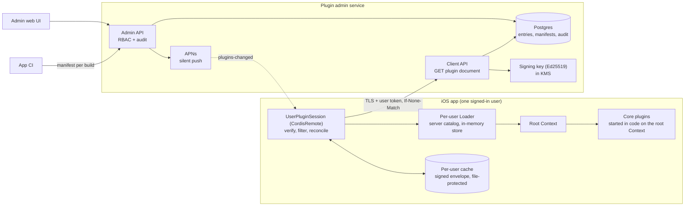
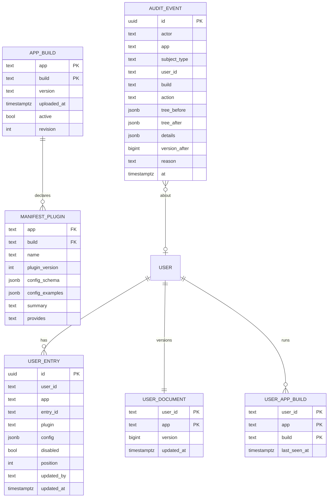

# Spec 0001: Per-user plugin activation from a server admin interface

| | |
| --- | --- |
| Status | Accepted for implementation |
| Owner | Ovidiu Eftimie |
| First consumer | Epic Drives iOS app |
| Delivered by | **cordis-ios**: library changes (§6.1) and a new `CordisRemote` library target (§6.2–§6.6). **Plugin admin service**: a new server repository (§7). **Epic Drives**: integration (§6.7). |
| Related | [Concepts: Loader](../pages/concepts.md#loader), [Architecture](../pages/architecture.md) |

## 1. Summary

An app built on cordis-ios runs two kinds of plugins:

- **Core plugins** are part of the app. They always run, and the server cannot switch them off or reconfigure them.
- **User plugins** are compiled into the app as well, but run for a user only when an administrator switches them on for that user in an admin interface. Each user has their own configuration.

The server sends each user a signed list of entries (which user plugins to run, with which config). The app checks the signature and the user, validates every config, and hands the valid entries to a per-user `Loader`. The loader starts, reconfigures or stops plugins by diffing against what is running.

The server never sends code. Every plugin is in the app binary. This keeps apps within App Store Review Guideline 2.5.2 (no downloaded executable code).

## 2. Goals

- G1. An administrator can enable, disable, configure and remove user plugins for a single user, and the change reaches that user's running app without an app update.
- G2. Configuration and plugin data are isolated per user, on the server and on a shared device.
- G3. Core plugins cannot be disabled, removed or reconfigured by anything the server sends.
- G4. The app only runs entries the server signed for the signed-in user and app. Tampered, replayed, expired or other-user documents are rejected.
- G5. A config that fails validation never reaches a plugin or the loader, and never stops other user plugins or core plugins from running.
- G6. The admin UI only offers plugins that exist in at least one active app build. For each plugin it shows which of the user's builds support it.
- G7. Every administrative change is attributable (who, what, when, for which user, why) and reversible.

## 3. Non-goals

- Downloading plugin code, scripts or interpreted logic.
- Server-side authorization for the backend APIs that plugins call. That remains each API's job (see §8.1). Activation is feature gating, not access control.
- Groups (`children`) and isolation (`isolate`) in server-sent entries. Version 1 entries are a flat list (R-V6).
- Cohort and percentage rollouts, A/B testing and scheduled activation. The data model keys entries by user, so these can be layered on later.
- Several users signed in to one app process at the same time.
- Android and web clients.

## 4. Terms

| Term | Meaning |
| --- | --- |
| Entry | One `Cordis.Entry`: `id`, `plugin` (catalog name), `config` (JSON), `disabled`. In version 1, server entries never carry `isolate` or `children`. |
| Core catalog | Plugins the host app starts itself, plus every service they provide. |
| Server catalog | The `PluginCatalog` of plugins the server may activate: the allow-list. |
| Plugin document | The signed list of entries for one user, one app and one build (§6.3). |
| Manifest | A machine-readable description of one app build's server catalog (§6.1, R-L4). |
| Session | The time between a user signing in and signing out, with one `UserPluginSession`. |

## 5. Architecture



1. CI uploads the manifest of every app build that ships.
2. An admin changes a user's entries. The admin API validates the config against the schemas of the builds that have the plugin, writes an audit event, bumps the user's document version and sends a silent push.
3. The app fetches the document and verifies it (R-V1 to R-V6). It drops entries that fail validation (R-V7), reconciles the per-user loader with the remaining entries and, only after that succeeds, writes the envelope to the cache.

## 6. iOS requirements

### 6.1 Library (`Cordis` target)

**R-L1. Validate without starting.**
- Add `@CordisActor func validateConfig(_ raw: JSONValue?) throws` to `AnyPlugin`. Its protocol-extension default calls `makeRuntime().resolveConfig(raw)`, which runs the same decoding and `validate(_:)` a fiber runs at start, and throws `ValidationError`. Existing `AnyPlugin` conformers keep compiling.
- Add `@CordisActor func validate(_ entries: [Entry]) -> [EntryIssue]` to `PluginCatalog`. It does not throw. It checks every entry, including disabled entries and the children of groups, and returns one issue per failing entry, in tree order.
- An entry with `children` is a group: its `plugin` is not looked up, only its children are checked.

```swift
public struct EntryIssue: Error, Equatable, Sendable {
  public enum Kind: Equatable, Sendable {
    case unknownPlugin(String)
    case invalidConfig([ValidationIssue])
  }
  public let entryId: String
  public let kind: Kind
}
```

**R-L2. Atomic validated reconcile.**
- Add `public enum ReconcilePolicy: Sendable { case saveFirst, validateFirst }`.
- Add `Loader.reconcile(_ entries: [Entry], policy: ReconcilePolicy = .saveFirst) async throws`. `.saveFirst` is the current behaviour.
- With `.validateFirst`, the loader runs `catalog.validate(entries)` first. If it returns any issue, the loader throws `LoaderError.invalidEntries([EntryIssue])`, does not call `store.save` and changes no fiber.
- The doc comment of `.saveFirst` states that a config failing validation is saved and the error is only logged.

**R-L3. Plugin metadata.**
- Add these static requirements to `Plugin`, with protocol-extension defaults:
  - `nonisolated static var configSchema: JSONValue`: JSON Schema draft 2020-12. Default `{"type": "object"}`.
  - `nonisolated static var configExamples: (valid: [JSONValue], invalid: [JSONValue])`. Default `([], [])`.
  - `nonisolated static var pluginVersion: Int`. Default `1`.
  - `nonisolated static var summary: String`. Default `""`.
- Server-catalog plugins must override `configSchema`, and give at least one valid and one invalid example (R-L5).

**R-L4. Descriptors and manifest.**
- `PluginCatalog.register(_ type: P.Type, as name:)` also stores a `PluginDescriptor` for `name`:

```swift
public struct PluginDescriptor: Sendable, Equatable {
  public let name: String              // the catalog registration name
  public let pluginVersion: Int
  public let title: String             // = name
  public let summary: String
  public let injects: [String]         // names from P.injections
  public let provides: String?         // P.Key.name when P is a ServicePlugin, else nil
  public let configSchema: JSONValue
  public let configExamples: [String: [JSONValue]]  // "valid", "invalid"
}
```

- `register(_ plugin: some AnyPlugin, as name:)` (function plugins) stores no descriptor.
- `PluginCatalog.descriptors: [PluginDescriptor]` is sorted by name.
- `PluginCatalog.manifest(app:version:build:) -> JSONValue` returns:

```json
{
  "schemaVersion": 1,
  "app": "com.example.epicdrives",
  "version": "2.3.0",
  "build": "412",
  "plugins": [
    {
      "name": "reports",
      "pluginVersion": 3,
      "title": "reports",
      "summary": "Weekly driving reports",
      "injects": ["dashboard", "api"],
      "provides": null,
      "configSchema": {
        "type": "object",
        "properties": { "period": { "enum": ["week", "month"] } },
        "additionalProperties": false
      },
      "configExamples": { "valid": [{ "period": "week" }], "invalid": [{ "period": "day" }] }
    }
  ]
}
```

The manifest includes every plugin that has a descriptor. Calling it on a catalog that contains a function plugin is a programmer error: it traps in debug builds.

**R-L5. Schema conformance helper.** Add `PluginCatalog.checkExamples() -> [String]`. For each descriptor:
- every `valid` example must pass `validateConfig`;
- every `invalid` example must fail it;
- no `configSchema` may contain the key `x-secret` at any depth.

It returns one message per violation. The server runs the same examples against the JSON Schema (R-S9), so the Swift decoder and the schema are checked against one shared set of examples.

### 6.2 `CordisRemote` target: sessions

A new library target, `CordisRemote` (iOS 17, macOS 14), depends on `Cordis` and CryptoKit. It contains everything in §6.2 to §6.6, so every host app reuses one implementation.

**R-A1. Two catalogs.**
- The host app starts core plugins on the root `Context` before creating any `UserPluginSession`, and waits until every core fiber has settled (`await fiber.await()`).
- The server catalog holds only `Plugin` types (no function plugins).
- `UserPluginSession.init` takes `coreServiceNames: Set<String>` and `coreNames: Set<String>`. It traps if a server-catalog descriptor's name is in `coreNames`, or its `provides` is in `coreServiceNames`.
- The host app passes every catalog name and every service name its core plugins use.

**R-A2. Session contents.** A `UserPluginSession` (`@CordisActor` class) owns:
- a `Loader` on the root context, over the server catalog, with an `InMemoryEntryStore`;
- the user's cache (R-C1) and storage (R-C4);
- a `PluginDocumentClient` (R-F1).

`start()` calls `loader.start()` once, then applies the cached document (R-A3) and starts fetching (§6.4). The only persistent copy of the entries is the signed envelope in the cache.

**R-A3. Start from cache.**
- If a cached envelope exists for this user, verify it (R-V1, R-V2, R-V4 to R-V6, and R-V3 against the stored version mark, R-C3), filter it (R-V7) and reconcile.
- If it fails verification, delete it and run no user plugins until a fetch succeeds.

**R-A4. Sign-out.** `stop()`:
1. stops fetching;
2. calls `loader.reconcile([], policy: .validateFirst)`, which disposes every user plugin and reverts its effects;
3. waits for that to finish;
4. deletes the user's cache directory and storage (R-C4).

The version mark (R-C3) is kept.

**R-A5. Account switching.** Creating a session for user B while user A's session exists is a programmer error. The host app must `await a.stop()` first. `UserPluginSession` enforces this with a process-wide single-active-session flag and traps if a second session starts.

**R-A6. User services.**
- User plugins may inject core services.
- User-scoped services are provided by the session on a child context of the root, so they are disposed with the session:
  - `UserStorageKey` (R-C4);
  - any services the host app passes to the session, such as an API client holding the user's token.

**R-A7. Expiry while running.**
- The session schedules a check at the applied document's `expiresAt`, and repeats it when the app enters the foreground.
- If the applied document has expired and no newer document was fetched, the session calls `loader.reconcile([], policy: .validateFirst)`.
- User plugins stay stopped until a fetch succeeds.

### 6.3 Plugin document: format and verification

**Format.** The server returns an envelope:

```json
{
  "keyId": "2026-10-a",
  "payload": "<base64url, no padding, of the UTF-8 JSON payload bytes>",
  "signature": "<base64url, no padding, Ed25519 signature over the decoded payload bytes>"
}
```

The signature covers the exact payload bytes, so the client needs no JSON canonicalisation. The payload is:

```json
{
  "schemaVersion": 1,
  "app": "com.example.epicdrives",
  "build": "412",
  "userId": "u_8f2c…",
  "issuedAt": "2026-10-12T09:30:00Z",
  "expiresAt": "2026-10-19T09:30:00Z",
  "version": 42,
  "entries": [
    { "id": "reports", "plugin": "reports", "config": { "period": "week" } },
    { "id": "beta", "plugin": "beta-editor", "disabled": true, "config": {} }
  ]
}
```

**Verification.** `PluginDocumentVerifier` runs these checks in order. The first failure rejects the whole document with the reason code in brackets.

- **R-V0. Shape.**
  - The envelope and payload decode: valid base64url, UTF-8 JSON, and every field present with the right type. [`malformed`]
  - `schemaVersion` is 1. [`unsupportedSchema`]
- **R-V1. Signature.** The signature verifies with the pinned public key named by `keyId` (`Curve25519.Signing.PublicKey`). An unknown `keyId` fails. [`unknownKey`, `badSignature`]
- **R-V2. Audience.**
  - `app` equals the bundle identifier. [`wrongApp`]
  - `userId` equals the session's user id. [`wrongUser`]
  - `build` equals the running `CFBundleVersion`. [`wrongBuild`]
- **R-V3. Freshness.** Compare (`version`, `issuedAt`) with the version mark (R-C3). Accept if `version` is higher, or `version` is equal and `issuedAt` is equal or later. Otherwise reject. [`replay`]
- **R-V4. Validity window.** `issuedAt` ≤ now + 5 minutes, and now < `expiresAt`. [`notYetValid`, `expired`]
- **R-V5. Size.** The payload is at most 256 KiB, and `entries` has at most 50 elements. [`tooLarge`]
- **R-V6. Content.**
  - Entry ids are unique. [`duplicateId`]
  - No entry has `children` or `isolate`. [`unsupportedField`]
  - No entry names a plugin in `coreNames`. [`corePlugin`]

**R-V7. Filtering, after verification succeeds.**
- Run `catalog.validate(entries)`. Every entry with an issue (unknown plugin or invalid config) is removed from the list that is reconciled, so it does not run and is stopped if it was running.
- The remaining entries are reconciled with `.validateFirst`.

**After reconcile succeeds:**
- write the envelope and ETag to the cache (R-C1);
- update the version mark (R-C3).

**If reconcile throws:**
- write nothing;
- keep the previous state;
- report reason `applyFailed`.

**Reporting.**
- Every rejection, and every entry dropped by R-V7, is reported with `POST /v1/plugin-document/reports`:

```json
{ "version": 42, "keyId": "2026-10-a", "reason": "invalidEntries", "entryIds": ["reports"] }
```

- `version` and `keyId` are `null` when they cannot be read (`malformed`).
- Reports never contain configs or validation messages.

### 6.4 Fetching and updates

**R-F1. Request.**
- `PluginDocumentClient` (with a `HTTPTransport` protocol, so tests use an in-memory transport) sends `GET /v1/me/plugin-document` with:
  - `Authorization: Bearer <token from the host app>`;
  - `X-App-Build: <CFBundleVersion>`;
  - `If-None-Match` with the cached ETag, if any.
- On `200`, the new envelope goes through §6.3.
- On `304`, nothing changes.

**R-F2. When to fetch.** A fetch is *successful* when the server answers `200` or `304`, whether or not the document is then accepted.
- In `start()`.
- When the app enters the foreground, if the last successful fetch is more than 15 minutes old.
- On a silent push whose payload contains `"cordis": "plugins-changed"`; this fetch ignores the 15-minute rule.
- On a timer the session schedules at `expiresAt` − 24 hours of the applied document. The timer is rescheduled whenever a document is applied.

**R-F3. Failures.**
- On network errors and `5xx`, keep the current state and retry after 30 s, doubling each time, capped at 15 minutes. The delay resets after a successful fetch.
- On `401` or `403`, stop retrying and call the host app's `tokenExpired` callback. The running user plugins and the cache stay as they are, subject to expiry (R-A7). Fetching resumes when the host calls `refresh()`.
- The server never uses `404` for this endpoint (R-S1). Any other status counts as a server error.

### 6.5 Storage and secrets

**R-C1. Cache.**
- `Application Support/cordis/users/<hex sha256(userId)>/document.json` holds `{ "etag": …, "envelope": … }`.
- It is written atomically, with file protection `.completeUntilFirstUserAuthentication`, and excluded from backups (`isExcludedFromBackup`).

**R-C2. No secrets in configs.**
- Configs are readable on the device.
- Tokens, passwords and keys belong in the user's Keychain storage (R-C4). Configs may hold only references to them.
- Schemas with `x-secret` are refused both by R-L5 (in the app's tests) and by R-S9 (on manifest upload).

**R-C3. Version mark.**
- The highest accepted (`version`, `issuedAt`) per user is stored in the Keychain:
  - service `cordis.version-mark`;
  - account `<hex sha256(userId)>`;
  - accessibility `kSecAttrAccessibleAfterFirstUnlockThisDeviceOnly`.
- It survives sign-out, so a replayed old document is still rejected after the user signs in again.

**R-C4. User storage.** The session provides service `UserStorageKey` (`UserStorage`) to user plugins:
- `directory`: `Application Support/cordis/users/<hash>/data/`;
- Keychain helpers scoped to service `cordis.user.<hash>`.

User plugins must keep all persistent state there. `stop()` deletes the directory and every Keychain item with that service.

**R-C5. Logging.** `CordisRemote` never logs config values, tokens or envelopes. Logs may contain entry ids, plugin names, versions, key ids and reason codes.

### 6.6 In-app visibility

R-U1. `UserPluginSession` exposes `activeEntries: [(id: String, plugin: String)]` for the host app to display. `CordisRemote` offers no API that changes server-managed entries on the device.

### 6.7 Epic Drives integration

R-E1. Epic Drives:
- splits its catalogs (R-A1);
- creates a `UserPluginSession` after sign-in and calls `stop()` on sign-out;
- forwards silent pushes and foreground events to it;
- uploads its manifest from CI for every build it ships (`PluginCatalog.manifest`, R-S9);
- ships the public keys (R-O1).

## 7. Server requirements

### 7.1 Components

- **Plugin admin service.** An HTTP API with two surfaces:
  - the client API, authenticated with Epic Drives end-user access tokens; the user id is the token's `sub` claim;
  - the admin API, authenticated with staff OIDC SSO, and service tokens for CI.
- **Postgres** for manifests, entries, document versions and the audit log.
- **A KMS-held Ed25519 signing key.** The private key never leaves KMS.
- **APNs** for silent pushes, through the host app's push credentials.
- **The admin web UI** (§7.5).

### 7.2 Data model



- `USER_ENTRY` has a unique key on (`user_id`, `app`, `entry_id`).
- `MANIFEST_PLUGIN` has a unique key on (`app`, `build`, `name`).
- Every mutation of a user's entries happens in one transaction that:
  - sets `USER_DOCUMENT.version` to `max(previous version + 1, current Unix time in milliseconds)`. Versions therefore rise even across user deletion (R-O3): a recreated user id always gets versions above any version mark a device still holds (R-C3).
  - writes one `AUDIT_EVENT` with `subject_type = 'user'`, `user_id`, and the user's whole entry tree in `tree_before` and `tree_after`.
- Build changes write an `AUDIT_EVENT` with `subject_type = 'build'`, `build`, and `details` = `{ "field": "active" | "manifest", "before": …, "after": … }`. Their `user_id`, `tree_before`, `tree_after` and `version_after` are null.
- User deletion writes an `AUDIT_EVENT` with `subject_type = 'user'` and `action = 'delete-user'`. Its `tree_before` holds the deleted entries, its `tree_after` is null, and its `version_after` is the new document version (R-O3).
- `AUDIT_EVENT` rows are insert-only for the service: its database role has no `UPDATE` or `DELETE` on that table. Only the retention job's role has them (R-O3).
- Client fetches upsert `USER_APP_BUILD` from `X-App-Build`.
- The client API derives `user_id` only from the verified token, never from a request parameter.

### 7.3 Client API

| Method | Path | Behaviour |
| --- | --- | --- |
| GET | `/v1/me/plugin-document` | Returns `200` with a signed envelope (§6.3) for the token's user and the request's `X-App-Build`, or `304`. |
| POST | `/v1/plugin-document/reports` | Accepts the report body from §6.3. Returns `202`. Limited to 30 reports per user per hour; extras are dropped. |

- **R-S1. Always a document.**
  - A user with no entries gets a signed document with `entries: []`.
  - If the user has no `USER_DOCUMENT` row (no admin has ever changed their entries), the document's `version` is `0`.
  - An unknown or inactive `X-App-Build` also gets a document with `entries: []`.
  - `401` means the token is invalid; `403` means the token lacks the app's audience. The endpoint never returns `404`.
- **R-S2. Signing and ETag.**
  - Each `APP_BUILD` row has a `revision` counter that increases whenever its manifest is replaced or its `active` flag changes.
  - The ETag is the hash of (`user_id`, `version`, `build`, `build revision`, `keyId`, current UTC date). Clients pick up build changes on their next fetch; build changes send no push.
  - The server signs a new document when no document exists yet for the current ETag. `issuedAt` is the signing time, and `expiresAt` = `issuedAt` + `documentTTL`, where `documentTTL` = 7 days. It may cache the signed envelope per ETag.
  - So a user's document is re-signed at least once per UTC day, and the client's `expiresAt` moves forward on its first fetch each day.
  - Responses carry `Cache-Control: private, no-store`.
- **R-S6. Per-build filtering.** When building a document for build `B`:
  - drop every entry whose `plugin` is not in `B`'s manifest;
  - drop every entry whose config does not validate against `B`'s schema for that plugin.

  Dropped entries are counted in metrics (R-O2), so build `B` never receives an entry it would reject.

### 7.4 Admin API

**Authentication and roles.**
- Staff authenticate with OIDC and have one of the hierarchical roles `plugin-viewer` < `plugin-editor` < `plugin-admin`.
- Service callers authenticate with OIDC client-credentials tokens:
  - `manifest-uploader` (CI) may only call `POST /builds`;
  - `account-deletion` (the Epic Drives account-deletion flow) may only call `DELETE /users/{userId}`.

**Entry mutations** (PUT, PATCH, DELETE on entries, and revert) require:
- a non-empty `reason`;
- `If-Match: <document version>`. A mismatch returns `412`.

Build changes and user deletion write an audit event with the actor and the change, but use no `If-Match`. `PATCH /builds/{build}` requires a `reason`.

| Method | Path | Role | Behaviour |
| --- | --- | --- | --- |
| POST | `/admin/v1/apps/{app}/builds` | manifest-uploader | Upload a manifest (R-L4). R-S9 applies. If the (`app`, `build`) already has a manifest, a byte-identical upload returns `200` (safe CI retries) and a different one returns `409`. |
| PATCH | `/admin/v1/apps/{app}/builds/{build}` | admin | Set `active`. |
| DELETE | `/admin/v1/apps/{app}/users/{userId}` | admin, account-deletion | Delete the user's data (R-O3). |
| GET | `/admin/v1/apps/{app}/plugins` | viewer | Plugins in active builds, with builds, `pluginVersion` and schema. |
| GET | `/admin/v1/apps/{app}/users/{userId}/entries` | viewer | Entries, document version, the user's builds (last 30 days), and support per entry per build. |
| PUT | `/admin/v1/apps/{app}/users/{userId}/entries/{entryId}` | editor | Create or replace an entry: `plugin`, `config`, `disabled`, `position`. |
| PATCH | `…/entries/{entryId}` | editor | Change `disabled` and/or `config`. |
| DELETE | `…/entries/{entryId}` | editor | Remove the entry. |
| POST | `/admin/v1/apps/{app}/users/{userId}/entries:revert` | admin | Body `{eventId, reason}`. Only events with `subject_type = 'user'` and a non-null `tree_after` can be reverted; any other event returns `422`. Sets the user's tree to the event's `tree_after`. This is a mutation like any other: new version, new audit event, push. |
| GET | `/admin/v1/audit?app=&userId=&actor=&from=&to=` | viewer | Audit events, newest first. |

**R-S3. Validation on write.**
- Validation applies to every entry that is enabled after the mutation, and to every entry whose config the mutation changes. This covers PUT, PATCH and revert (each enabled entry in the target tree).
- Disabling an entry, and DELETE, are never validated, so an admin can always switch a plugin off.
- For each validated entry:
  - `plugin` must exist in at least one active build of the app;
  - the config must validate against the plugin's schema in every active build that contains the plugin;
  - builds without the plugin are skipped.
- Any failure returns `422` with the entry ids and JSON Schema error paths, and nothing is written.

**R-S4. Limits.**
- At most 50 entries per user per app (else `409`).
- `entry_id` and plugin names match `^[a-z0-9][a-z0-9-]{0,63}$` (else `422`).
- Each config is at most 4 KiB as compact JSON (else `422`).

With these limits a payload stays under 256 KiB (R-V5). The server still checks the size when it signs. If the size is exceeded, it serves the previous document for that user and build, and raises an alert.

**R-S5. Build support.** The entries response marks, for each entry and each of the user's builds, whether that build supports the entry: plugin present and config valid. An entry that none of the user's builds support is allowed and is flagged `dormant`.

**R-S7. Push.** After each committed entry mutation, revert or user deletion, the service sends a silent push (`content-available: 1`, `"cordis": "plugins-changed"`) to the user's registered devices. A push failure does not fail the mutation.

**R-S8. Core plugins.** Core plugins are never in a manifest (R-A1, R-L4). Since R-S3 only accepts plugins that are in a manifest, core plugins cannot be targeted.

**R-S9. Manifest upload.** The service rejects a manifest with `422` if:
- any `configSchema` contains `x-secret` at any depth;
- any `valid` example fails, or any `invalid` example passes, its schema;
- a plugin's (`name`, `pluginVersion`) already exists in another manifest of the app with a different `configSchema`. Any schema change requires a new `pluginVersion`.

### 7.5 Admin web UI

**User page** (find a user by id, or by email through the identity provider):
- the entry list in `position` order, each with plugin, enabled toggle, config form, per-build support (R-S5) and the dormant flag;
- the document version, the user's builds with last-seen times, and the last five client reports (§6.3).

**Config form:**
- generated from the schema of the newest active build that contains the plugin;
- validates as the admin types;
- a JSON view;
- saving asks for a reason.

**Plugin page:** plugins with `pluginVersion`, summary and schema per active build, and the number of users with the plugin enabled.

**Audit page:**
- filter by user, actor and time;
- each event shows a diff of `tree_before` and `tree_after` (user events) or of `details` (build events);
- admins see a Revert button on events that can be reverted (user events with a `tree_after`).

**Roles:** viewers see read-only pages, editors can edit entries, and admins can also revert and manage builds.

### 7.6 Operations

- **R-O1. Key rotation.** Switching keys is a manual operator action, done by changing the service setting `activeSigningKeyId`:
  1. Generate a new key in KMS and add its public key to the app's pinned set in a release.
  2. When every build that is still `active` contains the new key, the operator switches `activeSigningKeyId`. The operator checks this from the release notes; manifests carry no key ids.
  3. Remove the old public key from the app one release later, and mark builds without the new key inactive.

  Only the signing service's identity may call KMS sign.
- **R-O2. Metrics.** Track:
  - documents served, and `304` rate;
  - entries dropped per build (R-S6);
  - client reports by reason;
  - admin mutations per day.

  Alert when client rejections exceed 0.5% of fetches over one hour.
- **R-O3. Retention.**
  - A scheduled retention job, running under its own database role `plugin_audit_retention` (the only role with `UPDATE` and `DELETE` on `AUDIT_EVENT`), deletes audit events older than 2 years.
  - `DELETE /users/{userId}`:
    - removes the user's entries and build rows;
    - sets the `USER_DOCUMENT` version by the §7.2 rule, so the user's devices receive an empty document they accept, and stop their user plugins;
    - records an audit event and sends the push (R-S7).

    The `USER_DOCUMENT` row is kept: it holds only the opaque user id and a version number, and without it a recreated account could be locked out by the version mark (R-C3). The retention job then replaces the user's `user_id` in all audit events with a salted hash within 24 hours.

## 8. Security considerations

### 8.1 Activation is not authorization

A modified client can run any compiled-in plugin with any config. Every backend endpoint that a user plugin calls must check, on the server, that the user is entitled to it. The plugin document controls what the app shows and runs, not what the backend allows.

### 8.2 Threats and mitigations

| Threat | Mitigation |
| --- | --- |
| Tampered document in transit or in the cache | Ed25519 signature over the payload bytes (R-V1). The cache is re-verified on every start (R-A3). |
| One user's document applied to another user, or on a shared device | Audience checks (R-V2), a per-user cache path (R-C1), and the cache and user storage deleted on sign-out (R-A4, R-C4). |
| Replaying an older document to re-enable a revoked plugin | Version mark kept across sign-out (R-V3, R-C3). Seven-day expiry (R-V4), also enforced while running (R-A7). |
| Server sends a config that fails validation | Server validation (R-S3, R-S6) and the shared examples (R-L5, R-S9). The client drops the entry (R-V7); other plugins are unaffected. |
| Server disables or reconfigures a core plugin | Core plugins are absent from the server catalog and manifests (R-A1, R-V6, R-S8). |
| A user plugin takes over a core service name | Startup check against `coreServiceNames` (R-A1). Core plugins are settled before any session starts (R-A1). `isolate` is not allowed in server entries (R-V6). |
| Secrets leaked through configs | `x-secret` is refused (R-L5, R-S9). Secrets go in the user's Keychain storage (R-C2, R-C4). Config values are never logged (R-C5). |
| Insider misuse of the admin UI | SSO with hierarchical RBAC, a mandatory reason, an insert-only audit log, and revert (§7.2, §7.4). |
| Leaked signing key | The key is in KMS and only the signing identity may use it. Rotation is in R-O1. Revoking a key needs an app release, because the key set is pinned. |
| Denial of service through an oversized document | Server limits (R-S4) and client limits (R-V5). |

## 9. Acceptance criteria

Each criterion is an automated test unless it is marked *manual*. In brackets: **L** = `swift test` in cordis-ios (`Cordis`), **R** = `swift test` in cordis-ios (`CordisRemote`, with an in-memory transport, a fixed clock and a test signing key), **S** = server integration tests against Postgres, **E** = Epic Drives on staging.

**Library**

1. **[L]** `PluginCatalog.validate` returns, in tree order:
   - `unknownPlugin` for an unknown name inside a group;
   - `invalidConfig` for a failing config on a disabled entry.

   Group entries themselves produce no issue.
2. **[L]** `reconcile(_, policy: .validateFirst)` with one invalid entry throws `invalidEntries`. `InMemoryEntryStore.saveCount` and `entries` are unchanged, and every fiber keeps its state.
3. **[L]** `reconcile(_, policy: .validateFirst)` with one entry's config changed calls `apply` again for that plugin only. Measure with a per-plugin apply counter: changed entry +1, unchanged entries +0.
4. **[L]** `manifest(...)` lists every registered `Plugin` type, with name (the catalog name), `pluginVersion`, `injects`, `provides` (the service key name for a `ServicePlugin`, `null` otherwise), schema and examples.
5. **[L]** `checkExamples()` reports:
   - a valid example that fails;
   - an invalid example that passes;
   - an `x-secret` key nested inside a schema.

**CordisRemote**

6. **[R]** Each of these is rejected with its reason code, leaving the cache, the version mark and the running plugins unchanged:
   - malformed base64;
   - a missing field;
   - `schemaVersion` 2;
   - an unknown key;
   - a bad signature;
   - another app, user or build;
   - a lower version;
   - an equal version with an earlier `issuedAt`;
   - not yet valid;
   - expired;
   - 51 entries;
   - a duplicate id;
   - an entry with `children`;
   - an entry with `isolate`;
   - a core plugin name.
7. **[R]** For a document with one invalid entry, that entry is not run (or is stopped), the others run, and one report with its entry id and no config is sent.
8. **[R]** An equal-version document with a later `issuedAt` replaces the cached envelope without restarting any plugin (apply counters unchanged), and the new `expiresAt` is stored.
9. **[R]** With a valid cache, `start()` runs the user plugins before the transport answers.
10. **[R]** `stop()`:
    - disposes every user plugin, so their effects are gone;
    - stops providing `UserStorageKey`;
    - deletes the cache file, the data directory and the `cordis.user.<hash>` Keychain items;
    - keeps the version mark and the core plugins.

    After a new sign-in by the same user, a document with a lower `version` than the last one accepted is rejected with `replay`. The last accepted document itself is accepted (R-V3).
11. **[R]** Starting a second session while one is active traps (death test, or a precondition hook in tests).
12. **[R]** When the clock passes `expiresAt` with no newer document, the user plugins are stopped. A later successful fetch starts them again.
13. **[R]** Fetch triggers:
    - foreground within 15 minutes of a successful fetch (including a `304`) does not fetch;
    - after 15 minutes it does;
    - a silent push always does;
    - the timer at `expiresAt` − 24 hours does.
14. **[R]** Backoff after failures: delays of 30, 60, 120, … seconds, capped at 900, reset after a `200` or `304`. A `401` or `403` stops fetching, calls `tokenExpired` and leaves the running plugins and the cache unchanged.
15. **[R]** Requests carry `Authorization`, `X-App-Build` and `If-None-Match`. A `304` changes nothing.
16. **[R]** The cache file is at the hashed path, has protection `.completeUntilFirstUserAuthentication` and is excluded from backups.
17. **[R]** With a capturing log exporter, a full apply-and-reject cycle logs no config value, token or envelope.
18. **[R]** `UserPluginSession.init` traps when a server-catalog plugin provides a service in `coreServiceNames`, or uses a name in `coreNames`. `activeEntries` lists exactly the entries that are running.

**Server**

19. **[S]** A PUT with a config that fails any active build containing the plugin returns `422`. Nothing is written and the version stays the same. A plugin found in no active build returns `422`.
20. **[S]** Each successful entry mutation, including revert, sets a version higher than the previous one, and at least the mutation time in milliseconds. It writes exactly one audit event with `tree_before`, `tree_after` and `reason`. A mutation without a reason returns `400`, and a stale `If-Match` returns `412`. A user deleted and then recreated with the same id gets a version above every version from before the deletion.
21. **[S]** Revert to event E sets the tree to E's `tree_after`. Reverting a build event or a delete-user event returns `422`.
22. **[S]** For a build whose manifest lacks plugin `X`, or whose schema rejects an entry's config, the served document omits that entry.
23. **[S]** The client API never returns another user's entries, whatever query parameters or headers are sent.
24. **[S]** Manifest upload is rejected for:
    - `x-secret`;
    - a failing valid example;
    - a passing invalid example;
    - a changed schema under an existing `pluginVersion`.
25. **[S]** Roles:
    - a viewer cannot mutate;
    - an editor cannot revert or change builds;
    - `manifest-uploader` can only upload manifests;
    - `account-deletion` can only delete users;
    - the service's database role cannot update or delete audit events, and only `plugin_audit_retention` can.
26. **[S]** The served document verifies with the published public key, and `expiresAt` = `issuedAt` + 7 days. Responses carry `Cache-Control: private, no-store`.
    - Two fetches on the same UTC day with no change → the second returns `304`.
    - The first fetch on the next day → `200` with a later `expiresAt`.
    - After `PATCH /builds/{build}` changes `active` → `200`.
    - A user with no entries, or an unknown build → `200` with `entries: []`.
27. **[S]** Limits and validation:
    - a 51st entry returns `409`;
    - a config over 4 KiB returns `422`;
    - an `entry_id` with an uppercase letter returns `422`;
    - disabling an entry whose config no longer validates succeeds;
    - re-uploading an identical manifest returns `200`, and a different manifest for the same build returns `409`.
28. **[S]** A committed mutation enqueues one silent push per registered device (the APNs client is mocked); a push failure still returns success. More than 30 client reports per user per hour are dropped.
29. **[S]** `DELETE /users/{userId}`:
    - removes the user's entries and build rows;
    - keeps the `USER_DOCUMENT` row with a higher version;
    - sends a push;
    - the next fetch returns an accepted document with `entries: []`.

    A user with no `USER_DOCUMENT` row gets `version: 0`. After the retention job runs, no audit event contains the raw `user_id`.

**End to end**

30. **[E]** With the app in the foreground, an admin enables a user plugin for user A. Within 10 seconds of the silent push arriving (seen in the device log), A's app shows the plugin. User B's app on a second device is unchanged. If the push does not arrive within 2 minutes, the run is retried; it is not counted as a failure.
31. **[E, manual]** A walkthrough of the admin UI:
    - viewer, editor and admin role differences;
    - dormant and per-build flags;
    - schema-driven form validation;
    - audit diff and revert.
32. **[E, manual]** Key rotation dry run on staging, following R-O1.

## 10. Rollout

1. **cordis-ios, library.** R-L1 to R-L5, tests 1–5. No behaviour change for existing loaders.
2. **cordis-ios, CordisRemote.** §6.2 to §6.6, tests 6–18.
3. **Plugin admin service.** §7.1 to §7.4 and §7.6, tests 19–29, deployed to staging.
4. **Admin web UI.** §7.5, test 31.
5. **Epic Drives.** R-E1. Then tests 30 and 32 on staging, then internal users, then everyone.

## 11. Integration inputs

These are inputs for implementation. They do not change any contract in this spec.

- **Backend.** The service runs next to the Epic Drives backend, in that backend's language and hosting. It needs Postgres, a KMS with Ed25519 signing, and APNs credentials.
- **Identity.** End-user tokens are the Epic Drives access tokens, and the user id is the `sub` claim. Staff log in with the organisation's OIDC provider.
- **Push.** Device tokens come from the Epic Drives push registration.
